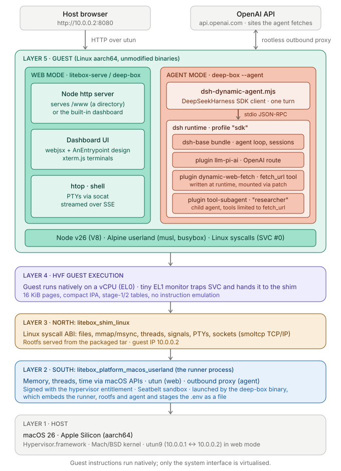

# LiteBox

> A security-focused library OS

> [!NOTE]  
> This project is currently actively evolving and improving. While we are
> working toward a stable release, some APIs and interfaces may change as the
> design continues to mature. You are welcome to explore and experiment, but if
> you need long-term stability, it may be best to wait for a stable release, or
> be prepared to adapt to updates along the way.

LiteBox is a sandboxing library OS that drastically cuts down the interface to the host, thereby reducing attack surface.  It focuses on easy interop of various "North" shims and "South" platforms.  LiteBox is designed for usage in both kernel and non-kernel scenarios.

LiteBox exposes a Rust-y [`nix`](https://docs.rs/nix)/[`rustix`](https://docs.rs/rustix)-inspired "North" interface when it is provided a `Platform` interface at its "South".  These interfaces allow for a wide variety of use-cases, easily allowing for connection between any of the North--South pairs.

Example use cases include:
- Running unmodified Linux programs on Windows
- Running unmodified Linux programs on macOS (Apple Silicon) -- see [docs/macos.md](./docs/macos.md)
- Sandboxing Linux applications on Linux
- Run programs on top of SEV SNP
- Running OP-TEE programs on Linux
- Running on LVBS

## Example: Node.js and the dsh agent on Apple Silicon

Unmodified Linux (aarch64) programs run natively on an Apple Silicon Mac: the guest's instructions execute on the CPU
through Hypervisor.framework (`--hvf`), and only the system interface is virtualized. The diagram shows the layers when
a Node.js server in an Alpine guest is opened from the host browser (web mode), or the dsh agent runs in the guest and calls OpenAI (agent mode).

  

See [docs/macos.md](./docs/macos.md) for the platform details, [`litebox-serve`](./litebox-serve) for a single binary that
serves a directory (or an Alpine dashboard) this way, and [`deep-box`](./deep-box) for the same plus running the dsh agent
in the guest.

## Contributing

See the following files for details:

- [CONTRIBUTING.md](./CONTRIBUTING.md)
- [CODE_OF_CONDUCT.md](./CODE_OF_CONDUCT.md)
- [SECURITY.md](./SECURITY.md)
- [SUPPORT.md](./SUPPORT.md)
- [docs/roadmap.md](./docs/roadmap.md) for known gaps and follow-up work

## License

MIT License.  See [./LICENSE](./LICENSE) for details.

## Trademarks

This project may contain trademarks or logos for projects, products, or services. Authorized use of Microsoft 
trademarks or logos is subject to and must follow 
[Microsoft's Trademark & Brand Guidelines](https://www.microsoft.com/en-us/legal/intellectualproperty/trademarks/usage/general).
Use of Microsoft trademarks or logos in modified versions of this project must not cause confusion or imply Microsoft sponsorship.
Any use of third-party trademarks or logos are subject to those third-party's policies.
